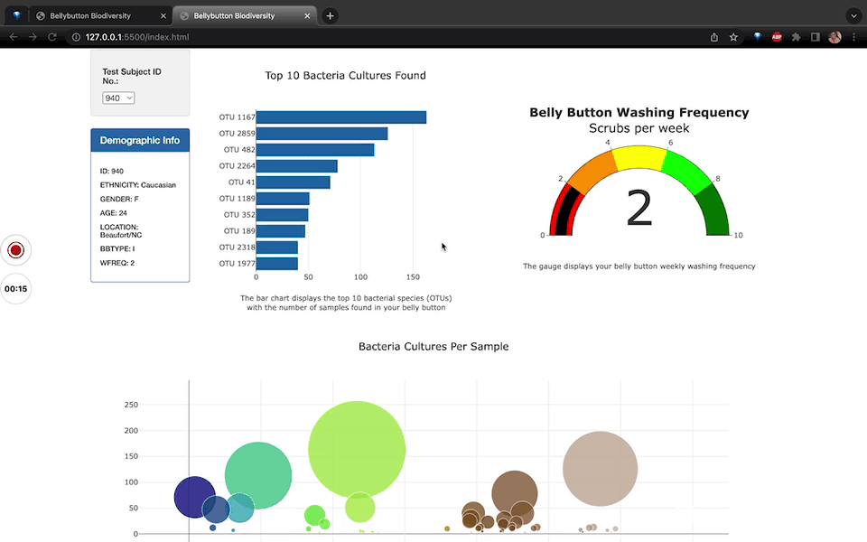

# Belly Button Biodiversity

## Project Overview
An interactive dashboard to visualize diversity among bacterial species, living in the navels of candidates for a research about meat protein synthesis from human bacteria. 

## Resources
- Data Source: [Belly button samples data](https://github.com/DevTrav/Belly_Button/blob/main/samples.json)
- Software: HTML/CSS, JavaScript, VS Code 1.49.1, BootStrap 3.3.7, D3, Plotly 4.11

### Results
The interactive dashboard was deployed as a webpage and is accessible at [live dashboard]().

